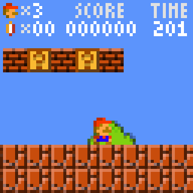

# SuperMB64 [work in progess]

Yet Another Super Mario Bros clone (World 1x1 only) - with a LowRezJam-like resolution (64x64 pixel)

This project created with the intent of writing some blog posts about it

Everything is done with C code, with a sample game framework (app.h by Mattias Gustavsson) that I already used for other little projects.
